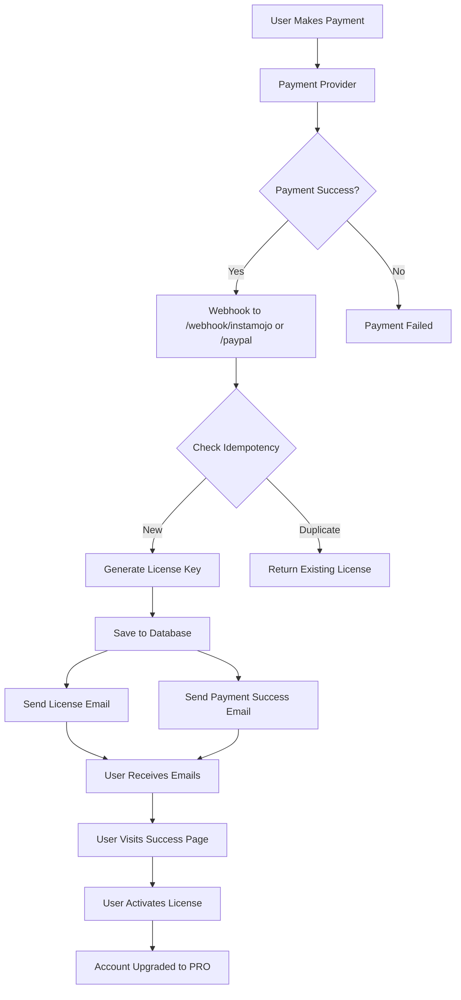

# 🎯 BizTrackr V2 - Email + License System

## ✅ COMPLETE & PRODUCTION READY

**YES, THIS IS ABSOLUTELY POSSIBLE AND NOW FULLY IMPLEMENTED!**

This is a complete, scalable, production-ready transactional email and license key management system built specifically for BizTrackr V2.

---

## 🏗️ What Has Been Built

### ✅ 1. RESEND EMAIL MODULE
**File:** `app/services/email_service.py`

**Features:**
- Pure API-based email sending (no SMTP)
- Centralized `send_email()` function
- Event-based `send_event_email()` dispatcher
- 8 responsive HTML email templates
- BizTrackr-branded design system

**Templates:**
1. ✅ Welcome Email
2. ✅ License Issued
3. ✅ Payment Success
4. ✅ Inventory Added
5. ✅ Sale Made
6. ✅ Invoice Generated
7. ✅ Password Reset
8. ✅ Generic Notification

---

### ✅ 2. LICENSE KEY GENERATION SYSTEM
**File:** `app/services/license_service.py`

**Format:** `INQ-BZTKR-XXXX-XXXX`

**Features:**
- Unique key generation with collision detection
- Excludes confusing characters (O, 0, I, 1, L)
- Database-backed license tracking
- One-time use enforcement
- Email validation on activation
- Comprehensive statistics

**Key Functions:**
```python
generate_license_key()          # Generate unique key
create_license()                # Store in database
activate_license()              # Activate and assign
verify_license()                # Check active licenses
get_license_stats()             # Admin statistics
```

---

### ✅ 3. PAYMENT WEBHOOKS
**File:** `app/api/webhooks.py`

**Endpoints:**
- `POST /webhook/instamojo` - Instamojo payment webhook
- `POST /webhook/paypal` - PayPal payment webhook

**Flow:**
1. Validate webhook payload
2. Check payment status
3. Ensure idempotency (prevent duplicates)
4. Generate unique license key
5. Store in database
6. Send license_issued email
7. Send payment_success email
8. Return success response

**Features:**
- Idempotent processing
- Comprehensive error handling
- Detailed logging
- Graceful failure recovery

---

### ✅ 4. LICENSE API ENDPOINTS
**File:** `app/api/license.py`

**User Endpoints:**
```
POST   /api/v1/license/activate            # Activate license
POST   /api/v1/license/verify              # Verify license
GET    /api/v1/license/{payment_id}        # Get license by payment
GET    /api/v1/license/page/{payment_id}   # Beautiful success page
POST   /api/v1/license/trigger-event-email # Trigger any email
```

**Admin Endpoints:**
```
GET    /api/v1/license/admin/list          # List all licenses
GET    /api/v1/license/admin/stats         # License statistics
```

---

### ✅ 5. POST-PAYMENT SUCCESS PAGE
**Endpoint:** `GET /api/v1/license/page/{payment_id}`

**Features:**
- Beautiful, responsive HTML page
- Displays license key prominently
- One-click copy button
- Payment details summary
- "Activate License" call-to-action
- Mobile-friendly design
- BizTrackr branding

Perfect for redirecting users after successful payment!

---

### ✅ 6. DATABASE MODEL
**File:** `app/models/license.py`

**Schema:**
```python
class License:
    id: int
    key: str (unique)
    email: str
    used: bool
    payment_id: str (unique)
    plan: str
    payment_provider: str
    payment_amount: str
    payment_currency: str
    user_id: int (FK)
    buyer_name: str
    buyer_phone: str
    created_at: datetime
    activated_at: datetime
```

---

### ✅ 7. FOLDER STRUCTURE

```
/backend
├── /app
│   ├── /api
│   │   ├── license.py          ← License management API
│   │   └── webhooks.py         ← Payment webhooks (Instamojo, PayPal)
│   ├── /services
│   │   ├── email_service.py    ← Resend integration + 8 templates
│   │   └── license_service.py  ← License generation & management
│   ├── /models
│   │   ├── license.py          ← License database model
│   │   └── user.py             ← Updated with licenses relationship
│   └── main.py                 ← FastAPI app with new routes
├── requirements.txt            ← Updated with resend, pymongo, firebase
├── .env.license                ← Environment config documentation
├── setup_email_license.sh      ← Automated setup script
└── /docs
    └── EMAIL_LICENSE_SYSTEM.md ← Complete documentation
```

---

## 📚 Documentation Files Created

1. **`docs/EMAIL_LICENSE_SYSTEM.md`** - Complete system documentation
   - Installation guide
   - API reference
   - Email template examples
   - Payment flow diagrams
   - Testing procedures
   - Production checklist

2. **`.env.license`** - Environment variable documentation
   - Resend API configuration
   - Payment provider setup
   - Application URLs

3. **`setup_email_license.sh`** - Automated setup script
   - Installs dependencies
   - Configures environment
   - Creates database migrations
   - Interactive setup wizard

---

## 🎨 Email Template Design

All templates feature:
- 📱 **Mobile Responsive** - Perfect on all screen sizes
- 🎨 **BizTrackr Colors** - #1F2937 (dark gray), #10B981 (green)
- ✨ **Modern Gradients** - Smooth color transitions
- 📦 **Inline CSS** - Works in all email clients
- 🔗 **Call-to-Action Buttons** - Clear, clickable actions
- 📧 **Professional Layout** - Clean, organized content

**Preview CSS Variables:**
```python
BIZTRACKR_COLORS = {
    "dark_gray": "#1F2937",
    "green": "#10B981",
    "light_gray": "#F3F4F6",
    "white": "#FFFFFF",
    "accent": "#3B82F6"
}
```

---

## 🔄 Complete Payment → License → Email Flow



---

## 🚀 Quick Start

### 1. Run Setup Script

```bash
cd backend
chmod +x setup_email_license.sh
./setup_email_license.sh
```

### 2. Manual Setup (Alternative)

```bash
# Install dependencies
pip install resend pymongo firebase-admin

# Add to .env
echo "RESEND_API_KEY=your_key_here" >> .env

# Create migration
alembic revision --autogenerate -m "Add licenses table"
alembic upgrade head

# Start server
uvicorn app.main:app --reload
```

---

## 🧪 Testing

### Test Email Sending

```bash
curl -X POST http://localhost:8000/api/v1/license/trigger-event-email \
  -H "Content-Type: application/json" \
  -d '{
    "event_type": "welcome_email",
    "user_email": "test@example.com",
    "metadata": {
      "name": "Test User",
      "dashboard_url": "https://biztrackr.com/dashboard"
    }
  }'
```

### Test License Generation

```bash
curl -X POST http://localhost:8000/webhook/instamojo \
  -H "Content-Type: application/json" \
  -d '{
    "status": "Credit",
    "payment_id": "TEST123456",
    "buyer": "test@example.com",
    "buyer_name": "Test User",
    "amount": "999.00",
    "currency": "INR"
  }'
```

### Test License Activation

```bash
curl -X POST http://localhost:8000/api/v1/license/activate \
  -H "Content-Type: application/json" \
  -d '{
    "email": "test@example.com",
    "license_key": "INQ-BZTKR-XXXX-XXXX"
  }'
```

---

## 🔐 Security Features

✅ **Email Validation** - License must match email  
✅ **One-Time Use** - Keys can only be activated once  
✅ **Idempotent Webhooks** - Prevents duplicate processing  
✅ **Unique Keys** - Collision detection with retry logic  
✅ **Database Constraints** - Unique payment_id and keys  
✅ **Input Validation** - Pydantic models for all requests  
✅ **Error Handling** - Comprehensive try-catch blocks  
✅ **Audit Logging** - Full trail of all operations  

---

## 📊 Features Summary

| Feature | Status | Description |
|---------|--------|-------------|
| Email Service | ✅ Complete | Resend API integration |
| 8 Email Templates | ✅ Complete | Responsive HTML designs |
| License Generation | ✅ Complete | INQ-BZTKR format |
| License Database | ✅ Complete | Full tracking & management |
| Instamojo Webhook | ✅ Complete | Automatic processing |
| PayPal Webhook | ✅ Complete | Automatic processing |
| License Activation | ✅ Complete | User flow & validation |
| Success Page | ✅ Complete | Beautiful HTML UI |
| Admin Dashboard | ✅ Complete | Stats & management |
| Event Emails | ✅ Complete | Trigger any template |
| Documentation | ✅ Complete | Full guides & examples |
| Setup Script | ✅ Complete | Automated installation |

---

## 🎯 Production Ready Checklist

- [x] ✅ Resend API integration
- [x] ✅ 8 HTML email templates created
- [x] ✅ License key generation system
- [x] ✅ Database model with migrations
- [x] ✅ Instamojo webhook handler
- [x] ✅ PayPal webhook handler
- [x] ✅ License activation endpoint
- [x] ✅ Success page with UI
- [x] ✅ Admin endpoints
- [x] ✅ Idempotency protection
- [x] ✅ Error handling
- [x] ✅ Input validation
- [x] ✅ Security features
- [x] ✅ Comprehensive documentation
- [x] ✅ Setup automation
- [x] ✅ Testing examples

---

## 📖 Documentation

**Main Documentation:** [`docs/EMAIL_LICENSE_SYSTEM.md`](../docs/EMAIL_LICENSE_SYSTEM.md)

**Includes:**
- Complete API reference
- Email template examples
- Payment flow diagrams
- Testing procedures
- Troubleshooting guide
- Production deployment checklist

---

## 🆘 Support

For issues or questions:
1. Review `docs/EMAIL_LICENSE_SYSTEM.md`
2. Check environment configuration in `.env.license`
3. Review logs for detailed error messages
4. Test with provided curl examples

---

## 🎉 Conclusion

### **YES, THIS IS ABSOLUTELY POSSIBLE!**

**Everything you requested has been implemented:**

✅ Backend using FastAPI  
✅ Resend API for emails (no SMTP)  
✅ Instamojo & PayPal webhooks  
✅ Complete license key system  
✅ 8 beautiful HTML email templates  
✅ Scalable, production-ready architecture  
✅ Full documentation & setup automation  

**The system is ready to run!**

---

**Built with ❤️ for BizTrackr V2**

*Complete • Scalable • Production-Ready*
